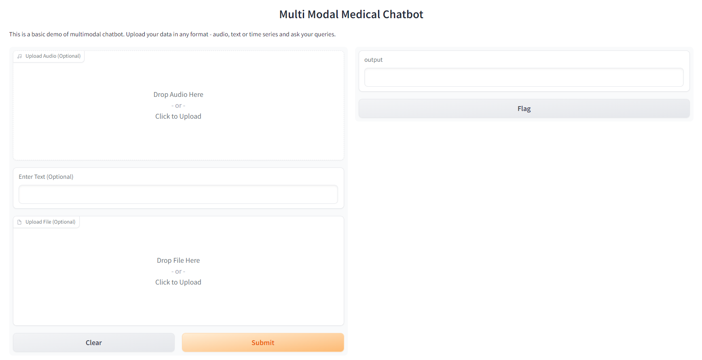

# Multimodal Medical LLama (MLLM) :stethoscope:
A fine tuned LLama model that accepts multimodal data as input and gives response as text. The model accepts data in text, audio and time series data (ECG Data). 


## Introduction
Multimodal language models have gained significant attention in recent years due to their ability to process diverse sources of information, such as text, speech, and time series data. This repository contains an implementation of an MLLM that leverages the power of pre-trained language models to perform various tasks across multiple modalities.

## How It Works :bulb:
Upload your audio, ECG data, or type in your medical query in the provided input fields.

The chatbot will process your input using cutting-edge machine learning models.

Based on the input, the chatbot will generate a response just like a real doctor would, providing valuable medical insights and advice.

The output will be displayed in the text box, allowing you to have a seamless conversation with the chatbot.

## Installation
- Clone the repository:
```git clone https://github.com/your-username/multimodal-language-model.git```
```cd multimodal-language-model```
- Create a virtual environment (optional but recommended):
```python -m venv venv```
```source venv/bin/activate```
- Install the required dependencies:
```pip install -r requirements.txt```

## Training 
- For training the CNN architecture for Multilabel data classification (ECG). 
  - Download the data from the website [Kaggle](https://www.kaggle.com/datasets/khyeh0719/ptb-xl-dataset) and place it in ```time_series/data/```
  - Run ```python time_series/train.py```
- For fine-tuning the LLama Model (GPU Required). 
  - Download the instruction tuned dataset and place it in ```llm/dataset/```
  - Run ```python llm/training.py```

## Inferencing 
- For inferencing the model run ```python inference.py```


## Demo 
The projects support a Gradio based GUI.



## Disclaimer :warning:
The MultiModal Medical Chatbot is designed for informational purposes only and should not be considered a substitute for professional medical advice. Always consult a qualified healthcare professional for personalized medical guidance.


